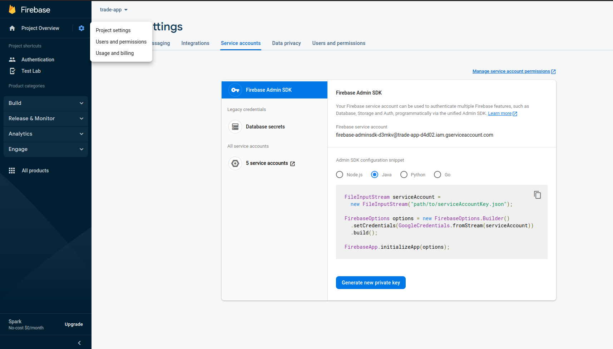
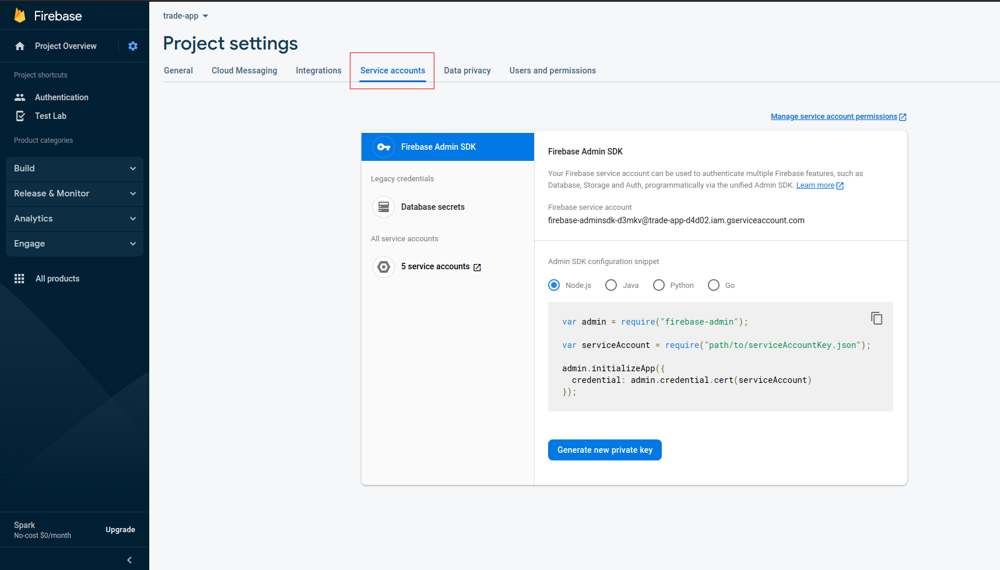
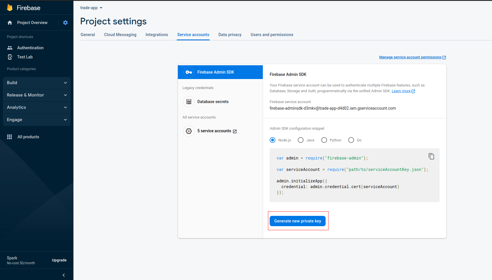
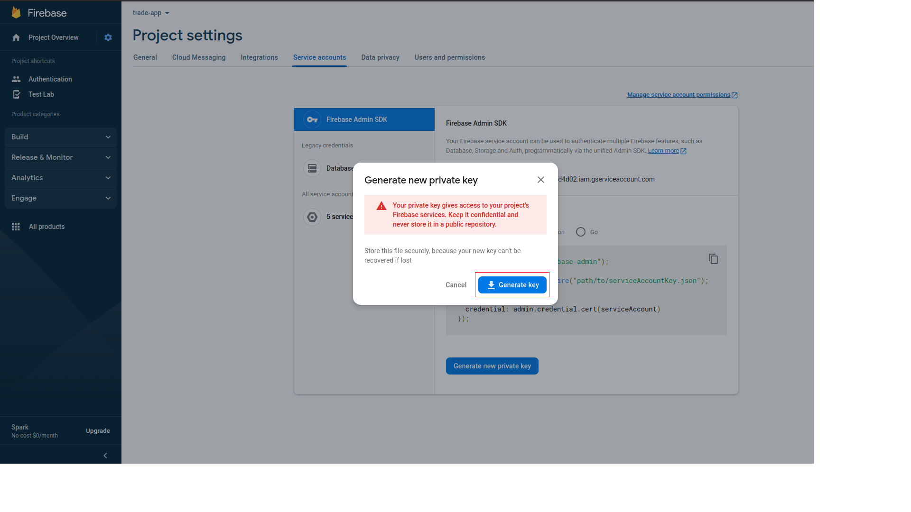

### Chạy server

```shell
sh ./run_server.sh
```

### Config Firebase Admin SDK

1. Tạo một ứng dụng Firebase
2. Vào mục Authentication -> Sign-in method và thêm provider Google và Facebook
3. Vào Project Settings
   

4. Chọn Service account
   

5. Chọn Generate new private key
   

6. Chọn Generate key
   

7. Copy nội dung file JSON mới thu được vào file resources/firebase-admin-sdk.json

### Config database

Bước 1: Tải và chạy docker Postgresql

```shell
sudo docker run --name postgresql -e POSTGRES_USER=root -e POSTGRES_PASSWORD=password -p 5432:5432 -v /data:/var/lib/postgresql/data -d postgres
```

Bước 2: Import bảng tbl_capital_socket_id từ file ```resources/tbl_stock.sql``` vào Postgresql

### Cách lấy thông tin giá chứng khoán realtime

[Capital](/src/main/java/com/backend/tradeappbackend/stock/README.md)